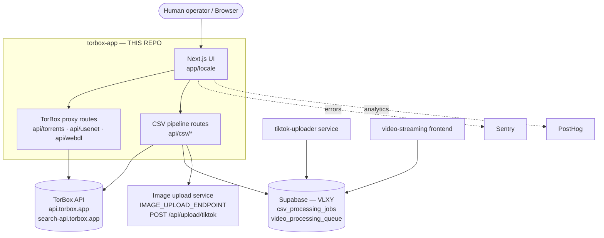

# 01 — System Context

This document describes torbox-app's role in the larger video platform and its boundary with every external system.

---

## Purpose 🟢

`torbox-app` is the **human-operated TorBox manager** and the **batch-ingestion entry point** for the video platform. A human operator uses its browser UI to:

1. Manage TorBox downloads (torrents, usenet, web-download) via proxy API routes.
2. Upload CSV files that the pipeline parses, enriches (thumbnail re-upload), and writes as rows into a shared Supabase database for downstream processing.

This app **does not serve end users**. It feeds the pipeline; processed videos flow from downstream services to the public frontend without any involvement from this app.

---

## C4 Context Diagram 🟢

---

## System Boundary Table 🟢

| External system | What it is | How this app interacts with it |
|---|---|---|
| **TorBox API** (`api.torbox.app`, `search-api.torbox.app`) | External debrid service | Proxy routes in `src/app/api/torrents/`, `usenet/`, `webdl/` forward every request with the operator's API key as `Authorization: Bearer <key>`. The CSV pipeline also calls the internal `/api/torrents` proxy to resolve torrent hashes to `torrent_id` + `file_id`. 🔵 |
| **Supabase (project VLXY)** | Shared Postgres database used by the whole platform | This app **only writes** two tables (see below). It never reads or writes the `videos` table (owned by downstream services). Client created via `src/utils/supabase/server.js` using the service-role `SUPABASE_SECRET_KEY` — server-side only, never exposed to the browser. 🟢 |
| ↳ `csv_processing_jobs` | Job tracking table | Written by `src/app/api/csv/process/route.js` (INSERT on upload) and `src/app/api/csv/process-job/[jobId]/route.js` (UPDATE: status, progress, results, errors). |
| ↳ `video_processing_queue` | Ingested video rows, consumed downstream | One row per valid CSV row, INSERTed by `src/app/api/csv/process-job/[jobId]/route.js` after torrent resolution and thumbnail re-upload. Fields: `index`, `status`, `progress`, `video_name`, `torrent_id`, `file_id`, `release_date`, `actresses`, `thumbnail_url`, `video_network`, `video_description`. |
| **Image upload service** (`IMAGE_UPLOAD_ENDPOINT`) | External service that re-hosts thumbnail images | The CSV pipeline downloads each CSV `thumbnail` URL, validates the image magic bytes, then POSTs it as multipart form-data to `IMAGE_UPLOAD_ENDPOINT/api/upload/tiktok`. The returned URL is stored in `video_processing_queue.thumbnail_url`. 🟢 |
| **tiktok-uploader service** | Downstream video processing service | Consumes `video_processing_queue` rows written by this app. This app has no direct connection to it — the boundary is purely the shared Supabase table. 🟢 |
| **video-streaming** | Public-facing video frontend (separate repo) | Reads the `videos` table in Supabase (populated by tiktok-uploader, not this app). It never reads `csv_processing_jobs` or `video_processing_queue`, and this app never reads or writes `videos`. 🟢 |
| **Sentry** | Error tracking / session replay | Instrumented on client (`sentry.client.config.ts`), server (`sentry.server.config.ts`), and edge (`sentry.edge.config.ts`). Errors and traces are sent to the project DSN. 🟢 |
| **PostHog** | Product analytics | Embedded via `NEXT_PUBLIC_POSTHOG_KEY` / `NEXT_PUBLIC_POSTHOG_HOST`; client-side analytics events only. 🟢 |

---

## What this app does NOT do 🟢

- **No end-user video serving** — it exposes no public video pages, no HLS streams, no search for viewers.
- **No transcoding or video processing** — raw torrent files are managed via TorBox; this app only queues metadata.
- **No writes to `videos`** — the `videos` table is owned by downstream services (tiktok-uploader, video-streaming). This app only writes `csv_processing_jobs` and `video_processing_queue`.
- **No direct database reads for the UI** — the operator UI drives TorBox proxy routes; Supabase is touched only by the CSV pipeline server routes.
- **No authentication layer for end users** — access is gated by the operator's TorBox API key, supplied at runtime in the browser.

---

## Cross-links

- `04-csv-ingestion-pipeline.md` — detailed sequence of CSV upload → job queuing → row insertion, with a Mermaid sequence diagram.
- `05-integrations.md` — TorBox API auth pattern, Supabase table schemas, image-upload service contract, Sentry/PostHog wiring.
- `06-deployment-and-infra.md` — Cloudflare / OpenNext and Docker deploy paths, env vars, `wrangler.jsonc`.
