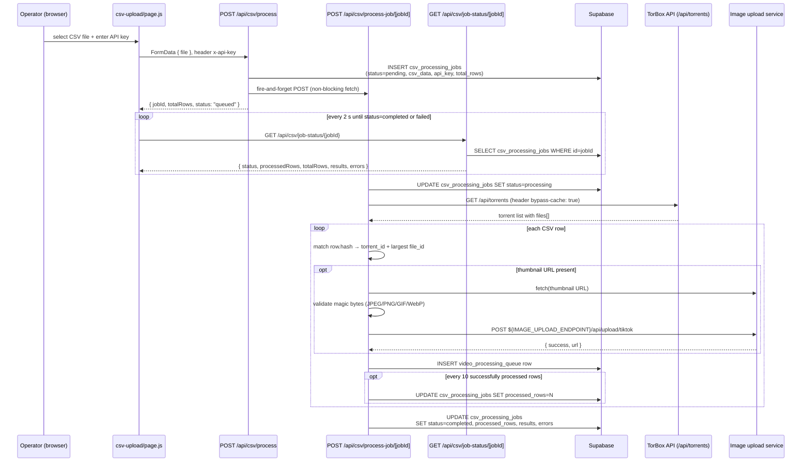

# 04 — CSV Ingestion Pipeline

Covers the operator-facing CSV upload flow that converts a spreadsheet of videos and torrent hashes into `video_processing_queue` rows consumed by the downstream tiktok-uploader.

**Source files:**
- `src/app/[locale]/csv-upload/page.js` — upload UI and polling loop
- `src/app/api/csv/process/route.js` — queues the job
- `src/app/api/csv/process-job/[jobId]/route.js` — background worker
- `src/app/api/csv/job-status/[jobId]/route.js` — status polling endpoint
- `src/utils/supabase/server.js` — Supabase client factory

---

## 1. Overview

The pipeline is the primary way operators populate the video catalog. An operator uploads a CSV file (videos + torrent hashes) through the `/csv-upload` page. The API immediately persists the raw CSV text and metadata to a `csv_processing_jobs` row (`status = pending`), fires a background POST to the worker route, and returns a `jobId`. The browser polls `/api/csv/job-status/[jobId]` every 2 seconds; the worker runs to completion independently. When every row is processed the job status becomes `completed` and the polling loop stops.

The end product is one row per valid CSV row in `video_processing_queue`, which is the handoff boundary to the downstream tiktok-uploader (see §7).

---

## 2. CSV Row Schema

| Column | Required | Format / Notes |
|---|---|---|
| `title` | Yes | Video title string |
| `hash` | Yes | Torrent info-hash; matched case-insensitively against TorBox torrent list |
| `video_network` | No | Network / studio name |
| `release_date` | No | `YYYY-MM-DD` |
| `actresses` | No | Comma-separated actress names |
| `thumbnail` | No | Absolute URL; downloaded, MIME-validated, and re-uploaded to the image service |
| `description` | No | Free-text video description |
| `magnet` | — | Accepted but **ignored** by the processing worker |

Column names are trimmed of whitespace during parse (`transformHeader: (h) => h.trim()`). Only `title` and `hash` are validated as required; all other fields default to `null` when absent or blank.

---

## 3. Sequence Diagram



---

## 4. `csv_processing_jobs` Columns Written

| Column | Type | Description |
|---|---|---|
| `id` | uuid | Client-generated via `randomUUID()` |
| `status` | text | `pending` → `processing` → `completed` \| `failed` |
| `total_rows` | integer | Row count from full CSV parse at queue time |
| `processed_rows` | integer | Updated every 10 successful rows; final value at completion |
| `csv_data` | text | Raw CSV text stored verbatim for background processing |
| `api_key` | text | TorBox API key stored to fetch torrents server-side |
| `results` | jsonb | Array of `{ row, title, queueItemId }` for successful rows |
| `errors` | jsonb | Array of `{ row, error }` or `{ row, warning }` for failures |
| `created_at` | timestamptz | Set at insert time |
| `updated_at` | timestamptz | Updated on every status change |

**Insert** (`process/route.js`):

```js
const { data: job, error: insertError } = await supabase
  .from('csv_processing_jobs')
  .insert({
    id: jobId,
    status: 'pending',
    total_rows: totalRows,
    processed_rows: 0,
    csv_data: csvText,
    api_key: apiKey,
    created_at: new Date().toISOString(),
    updated_at: new Date().toISOString(),
  })
  .select()
  .single();
```

**Final update** (`process-job/[jobId]/route.js`):

```js
await supabase
  .from('csv_processing_jobs')
  .update({
    status: 'completed',
    processed_rows: processedCount,
    results: results,
    errors: errors.length > 0 ? errors : undefined,
    updated_at: new Date().toISOString(),
  })
  .eq('id', jobId);
```

---

## 5. `video_processing_queue` Columns Written

One row is inserted per successfully resolved CSV row. Fields are taken directly from the CSV plus the resolved `torrent_id`/`file_id` pair.

| Field | Value | Source |
|---|---|---|
| `index` | `-1` | Hardcoded sentinel (ordering handled downstream) |
| `status` | `'queued'` | Hardcoded initial state |
| `progress` | `0` | Hardcoded |
| `video_name` | `title.trim()` | CSV `title` column |
| `torrent_id` | `String(torrent.id \| torrent.torrent_id)` | Resolved from TorBox torrent list |
| `file_id` | `String(largestFile.id)` | Largest file by `size` within the torrent |
| `release_date` | `release_date?.trim() \| null` | CSV `release_date` column |
| `actresses` | `actresses?.trim() \| null` | CSV `actresses` column |
| `thumbnail_url` | uploaded URL or `null` | Result of image upload (see §6) |
| `video_network` | `video_network?.trim() \| null` | CSV `video_network` column |
| `video_description` | `description?.trim() \| null` | CSV `description` column |

**Insert** (`process-job/[jobId]/route.js`):

```js
const { data: queueItem, error: insertError } = await supabase
  .from('video_processing_queue')
  .insert({
    index: -1,
    status: 'queued',
    progress: 0,
    video_name: title.trim(),
    torrent_id: String(torrent_id),
    file_id: String(file_id),
    release_date: release_date?.trim() || null,
    actresses: actresses?.trim() || null,
    thumbnail_url: thumbnail_url?.trim() || null,
    video_network: video_network?.trim() || null,
    video_description: video_description,
  })
  .select()
  .single();
```

---

## 6. Thumbnail Handling

Thumbnail processing is best-effort: a failure adds a warning to `errors` and leaves `thumbnail_url` as `null`, but does not abort the row.

**Steps:**

1. **Download** — `fetch(thumbnail.trim())` retrieves the remote image.
2. **Magic-byte MIME validation** — the first bytes of the response body are inspected to confirm the file is a recognised image type. The four accepted signatures are:
   - **JPEG**: `FF D8 FF`
   - **PNG**: `89 50 4E 47`
   - **GIF**: `47 49 46 38`
   - **WebP**: `52 49 46 46 … 57 45 42 50` (RIFF….WEBP at offsets 0–3 and 8–11)
   If no signature matches, the row warning reads: `"Downloaded file does not have valid image file headers."` and `thumbnail_url` is left `null`.
3. **Re-upload** — the validated buffer is posted as `multipart/form-data` to `${IMAGE_UPLOAD_ENDPOINT}/api/upload/tiktok`. The filename is `thumbnail-{hash}-{timestamp}.jpg`. The environment variable `IMAGE_UPLOAD_ENDPOINT` must be set; if absent, thumbnail processing throws and falls back to `null`.
4. **Store URL** — on a successful upload response (`{ success: true, url: "..." }`), `thumbnail_url` is set to the returned URL and stored in `video_processing_queue`.

---

## 7. Hand-off to Downstream

`video_processing_queue` is the integration boundary. Rows written by this pipeline (with `status = 'queued'`) are consumed by the **tiktok-uploader** service, which picks them up, encodes/uploads the video, and updates `status` and `progress`.

This pipeline does **not** write to any other table and makes no assumptions about how or when the tiktok-uploader runs.

Cross-references:
- System context and external service diagram: [`01-system-context.md`](./01-system-context.md)
- Integrations (TorBox API, image service, tiktok-uploader): [`05-integrations.md`](./05-integrations.md)

---

## 8. Supabase Client

All database access in the pipeline uses `createSupabaseClient()` (exported from `src/utils/supabase/index.js`), which delegates to `createSupabaseServerClient()` in `src/utils/supabase/server.js`. This creates a raw `@supabase/supabase-js` client authenticated with the `SUPABASE_SECRET_KEY` service-role key. It is never exposed to the browser; all three API routes are server-side Next.js Route Handlers.

---

## 9. Error and Edge-Case Behaviour

| Condition | Behaviour |
|---|---|
| Missing `title` or `hash` | Row skipped; error pushed to `errors[]` |
| Hash not found in TorBox torrent list | Row skipped; error pushed to `errors[]` |
| Torrent has no files | Row skipped; error pushed to `errors[]` |
| Thumbnail download/validation/upload fails | Row **still inserted** with `thumbnail_url = null`; warning pushed to `errors[]` |
| `csv_processing_jobs` insert fails | HTTP 500 returned immediately; no job created |
| Background trigger (`process-job`) unreachable | Logged, not fatal; job stays `pending` (can be re-triggered manually) |
| Job already `processing` when worker called | HTTP 409 returned; no duplicate processing |
| Job already `completed` when worker called | Worker returns early with existing results |
| Progress updates | Written to DB every 10 successfully processed rows to limit write amplification |
