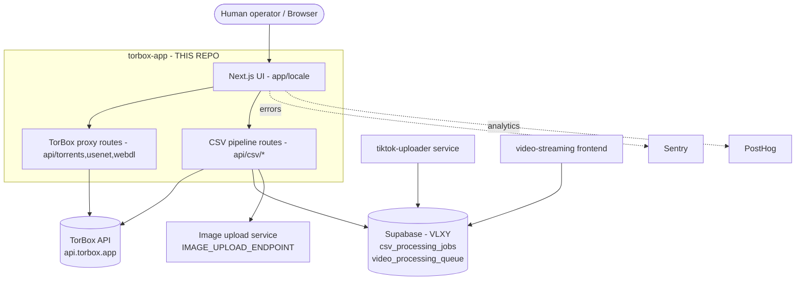
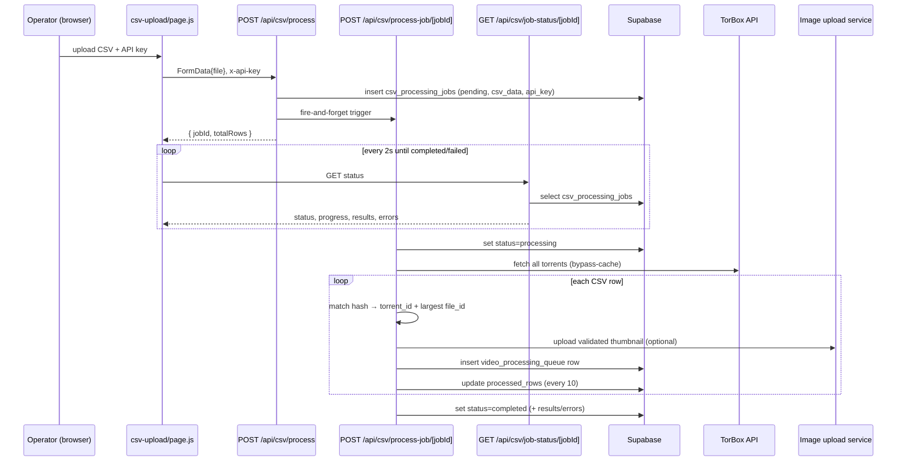

# torbox-app Architecture Documentation Implementation Plan

> **For agentic workers:** REQUIRED SUB-SKILL: Use superpowers:subagent-driven-development (recommended) or superpowers:executing-plans to implement this plan task-by-task. Steps use checkbox (`- [ ]`) syntax for tracking.

**Goal:** Produce a focused set of architecture reference docs under `docs/architecture/` so humans and AI agents understand the torbox-app — a TorBox Manager fork with a custom CSV→Supabase ingestion pipeline — and how it fits the larger video platform.

**Architecture:** One Markdown file per concern plus a `README.md` index. Each doc is grounded in current code (read the cited source files before writing — never guess), tags content **🔵 Upstream** vs **🟢 Custom**, uses scannable tables, and embeds Mermaid diagrams. Existing `README.md` and `DOCKER.md` are linked, not duplicated.

**Tech Stack:** Next.js 15 (App Router) · React 19 · Zustand · next-intl · papaparse · @supabase/supabase-js · Sentry · PostHog · next-pwa. Deploys via Cloudflare (OpenNext) and Docker. Primarily JavaScript (`.js`/`.mjs`).

**Spec:** `docs/superpowers/specs/2026-06-09-architecture-documentation-design.md`

---

## How verification works in this plan

No test runner for prose. Each task ends with real shell checks:

- Doc exists: `test -f <doc>`
- No placeholders: `grep -nE 'TODO|TBD|FIXME|PLACEHOLDER|XXX' <doc>` → expect **no output**
- Cited source paths resolve (final task): a loop that runs `test -e` on each backticked path.

The writer MUST open and read the listed source files before writing each doc. Accuracy comes from reading the code.

## Legend convention (all docs)

Use these tags inline and in tables:
- 🔵 **Upstream** — original TorBox Manager code (torrents/usenet/webdl UI, state, i18n, shared components, PWA).
- 🟢 **Custom** — added for this platform (CSV ingestion, Supabase queue, Cloudflare/Docker deploy, Sentry/PostHog wiring).

## File structure (what gets created)

```
docs/architecture/
  README.md                       # index + reading order + upstream/custom legend
  01-system-context.md            # boundary: operator → TorBox API → Supabase → downstream (C4 diagram)  🟢
  02-frontend-architecture.md     # App Router, i18n, components, Zustand, hooks, PWA                      🔵
  03-api-routes.md                # all Route Handlers (TorBox proxy + csv) endpoint table                 mixed
  04-csv-ingestion-pipeline.md    # KEYSTONE: CSV → jobs → queue → Supabase (sequence diagram)             🟢
  05-integrations.md              # TorBox API, Supabase tables, Sentry, PostHog, image-upload service     mixed
  06-deployment-and-infra.md      # Cloudflare/OpenNext + Docker, env vars, next.config                    mixed
```

Each doc is independent; Tasks 2–7 can run in any order after Task 1. Recommended order: Task 1 → Task 8.

---

### Task 1: Scaffold the folder and the README index

**Files:**
- Create: `docs/architecture/README.md`

- [ ] **Step 1: Write the index**

Write `docs/architecture/README.md` with:

1. **What this app is** — one paragraph: a fork of the open-source **TorBox Manager** (`jittarao/torbox-app`, AGPL-3.0), a Next.js 15 power-user UI for the TorBox debrid service, extended with a custom CSV→Supabase ingestion pipeline that feeds a larger video platform.
2. **Upstream / Custom legend** — define 🔵 Upstream and 🟢 Custom (see legend above).
3. **How it fits the bigger system** — short paragraph + bullets: human operator uses the UI; upstream features proxy the **TorBox API**; the custom pipeline writes **Supabase** (`csv_processing_jobs`, `video_processing_queue`) consumed downstream by the tiktok-uploader and ultimately the `video-streaming` frontend.
4. **Document index** — table linking the 6 docs below with a one-line description and its 🔵/🟢/mixed tag:
   - `01-system-context.md` — boundaries with TorBox, Supabase, downstream services; C4 diagram. 🟢
   - `02-frontend-architecture.md` — App Router, i18n, components, Zustand stores, hooks, PWA. 🔵
   - `03-api-routes.md` — every Route Handler (TorBox proxy + csv), endpoint table. mixed
   - `04-csv-ingestion-pipeline.md` — the keystone CSV→Supabase flow + sequence diagram. 🟢
   - `05-integrations.md` — TorBox API, Supabase tables, Sentry, PostHog, image-upload service. mixed
   - `06-deployment-and-infra.md` — Cloudflare/OpenNext + Docker, env vars, next.config. mixed
5. **Reading order** — newcomer: 01 → 04 (the keystone) → 03 → 02, then 05/06. (Lead with context + the custom pipeline since that's what's unique.)
6. **Conventions note** — Mermaid diagrams; source files linked by path; the legend; existing `README.md` (upstream) and `DOCKER.md` are linked, not duplicated.

Use relative Markdown links (e.g. `[01-system-context.md](./01-system-context.md)`).

- [ ] **Step 2: Verify**

```bash
cd /home/nguyenhaison/works/torbox-app
test -f docs/architecture/README.md && grep -nE 'TODO|TBD|FIXME|PLACEHOLDER|XXX' docs/architecture/README.md; echo "done"
```
Expected: file exists; grep prints nothing.

- [ ] **Step 3: Commit**

```bash
git add docs/architecture/README.md
git commit -m "docs(arch): add architecture docs folder + index"
```

---

### Task 2: System context (`01-system-context.md`) 🟢

**Files:**
- Create: `docs/architecture/01-system-context.md`
- Read first: `.env.example`, `src/utils/supabase/server.js`, `src/app/api/csv/process-job/[jobId]/route.js` (to confirm downstream tables), `README.md`, `DOCKER.md`.

- [ ] **Step 1: Write the doc**

Required content (open with a one-line "what this covers"; link source files by path):

1. **Purpose paragraph** — this app is the human-operated TorBox manager + the batch-ingestion entry point for the video platform. It does not serve end users; it feeds the pipeline.
2. **C4-style context diagram** (Mermaid). Start from this skeleton, refine labels as needed:



3. **System boundary table** — for each external part (TorBox API, Supabase, image-upload service, tiktok-uploader, video-streaming, Sentry, PostHog): what it is, how THIS app interacts with it, and (for Supabase) which tables it writes (`csv_processing_jobs`, `video_processing_queue`) vs. which the downstream apps own (`videos`, etc., never touched here).
4. **What this app does NOT do** — no end-user video serving, no transcoding, no writes to `videos`; it only manages TorBox downloads and queues ingestion rows.
5. **Cross-links** — to `04-csv-ingestion-pipeline.md`, `05-integrations.md`, `06-deployment-and-infra.md`.

- [ ] **Step 2: Verify**

```bash
cd /home/nguyenhaison/works/torbox-app
test -f docs/architecture/01-system-context.md && grep -nE 'TODO|TBD|FIXME|PLACEHOLDER|XXX' docs/architecture/01-system-context.md; echo done
```

- [ ] **Step 3: Commit**

```bash
git add docs/architecture/01-system-context.md
git commit -m "docs(arch): system context + external boundaries"
```

---

### Task 3: Frontend architecture (`02-frontend-architecture.md`) 🔵

**Files:**
- Create: `docs/architecture/02-frontend-architecture.md`
- Read first: `src/app/layout.js`, `src/app/page.tsx`, `src/app/[locale]/layout.js`, `src/app/[locale]/providers.js`, every `src/app/[locale]/*/page.js`, `src/middleware.ts`, `src/i18n/` (routing/settings/navigation), the Zustand stores (`src/store/torrentsStore.js`, `src/store/uploaderStore.js`, `src/stores/searchStore.js`), `src/hooks/*`, and skim `src/components/` subfolders.

- [ ] **Step 1: Write the doc**

Required content:

1. **App Router layout** — table of routes under `src/app/[locale]/`: `page.js` (home/downloads), `csv-upload/page.js` (🟢), `search/page.js`, `tools/page.js`, `link-history/page.js`, `archived/page.js`. Note root `layout.js` → `[locale]/layout.js` (wraps `NextIntlClientProvider` + `PostHogProvider`).
2. **i18n** — next-intl: locales `en, es, de, fr, ja` (default `en`) from `src/i18n/settings.ts`; `src/middleware.ts` enforces locale prefix (matcher excludes `/api`, `/_next`, assets); `LanguageSwitcher` component.
3. **Components by feature** — table grouping `src/components/`: root (`Header.js`, `LandingPage.js`, `LanguageSwitcher.js`, `icons.js`, `constants.js`), `downloads/` (Downloads, ItemRow, ItemsTable, CardList, ItemActions, UploadForm, ApiKeyManager, AutomationRules, ActionBar/, …), `search/` (SearchBar, SearchResults), `shared/` (FileHandler, DropZone, Toast, Dropdown, Spinner, Tooltip, ConfirmButton, AssetTypeTabs, …), `ArchivedDownloads/`, `LinkHistory/`. One line each for the notable ones.
4. **State (Zustand)** — table: `useTorrentsStore` (`src/store/torrentsStore.js`) torrent list + find-by-hash; `useUploaderStore` (`src/store/uploaderStore.js`) upload queue/progress; `useSearchStore` (`src/stores/searchStore.js`) search query/results. **Call out the `store/` (singular) vs `stores/` (plural) directory split** as a historical artifact, no functional difference.
5. **Hooks** — table: `useArchive`, `useColumnWidths`, `useFileHandler`, `useIsMobile` (one-liner each, from reading `src/hooks/`).
6. **PWA** — next-pwa, enabled in production, registers a service worker to `/public`.

- [ ] **Step 2: Verify**

```bash
cd /home/nguyenhaison/works/torbox-app
test -f docs/architecture/02-frontend-architecture.md && grep -nE 'TODO|TBD|FIXME|PLACEHOLDER|XXX' docs/architecture/02-frontend-architecture.md; echo done
ls src/store src/stores src/hooks
```
Expected: doc exists; no placeholders; every store/hook file appears in the doc.

- [ ] **Step 3: Commit**

```bash
git add docs/architecture/02-frontend-architecture.md
git commit -m "docs(arch): frontend architecture (App Router, i18n, state)"
```

---

### Task 4: API routes (`03-api-routes.md`) mixed

**Files:**
- Create: `docs/architecture/03-api-routes.md`
- Read first (open EACH): `src/components/constants.js` (TorBox base URLs), every file under `src/app/api/**/route.js`. Confirm exact TorBox paths and the auth header.

- [ ] **Step 1: Write the doc**

Required content:

1. **Auth & base URLs** — TorBox base `https://api.torbox.app`, search base `https://search-api.torbox.app`, version `v1` (from `src/components/constants.js`). Proxy routes read the key from the `x-api-key` header (client localStorage) and forward it to TorBox as `Authorization: Bearer <key>`. **Verify the exact full path** (e.g. `${API_BASE}/v1/api/torrents/mylist`) by reading the route files.
2. **Endpoint reference table** — columns: Tag | Method | Path | File | Reads | Calls. Cover every route file. Groups:
   - 🔵 **torrents** — `route.js` (GET list+queued, POST create, DELETE), `download`, `control`, `controlqueued`, `search` (incl. IMDB), `export`.
   - 🔵 **usenet** — `route.js` (GET/POST/DELETE), `search`, `control`, `download`.
   - 🔵 **webdl** — `route.js` (GET/POST/DELETE), `control`, `download`.
   - 🟢 **csv** — `process` (POST, → Supabase insert job), `process-job/[jobId]` (POST, processes rows → Supabase), `job-status/[jobId]` (GET, polls). For the csv rows, keep detail light here and link `04-csv-ingestion-pipeline.md` for the deep dive.
   Fill Reads/Calls from actually reading each file.
3. **Pattern note** — the proxy routes are thin pass-throughs that merge `mylist` + `getqueued` for each asset type; the csv routes are the only ones touching Supabase.

- [ ] **Step 2: Verify**

```bash
cd /home/nguyenhaison/works/torbox-app
test -f docs/architecture/03-api-routes.md && grep -nE 'TODO|TBD|FIXME|PLACEHOLDER|XXX' docs/architecture/03-api-routes.md; echo done
find src/app/api -name route.js | sort
```
Expected: doc exists; no placeholders; every route file appears in the doc.

- [ ] **Step 3: Commit**

```bash
git add docs/architecture/03-api-routes.md
git commit -m "docs(arch): API route handlers (TorBox proxy + csv)"
```

---

### Task 5: CSV ingestion pipeline — KEYSTONE (`04-csv-ingestion-pipeline.md`) 🟢

**Files:**
- Create: `docs/architecture/04-csv-ingestion-pipeline.md`
- Read first (open EACH, this is the depth focus): `src/app/[locale]/csv-upload/page.js`, `src/app/api/csv/process/route.js`, `src/app/api/csv/process-job/[jobId]/route.js`, `src/app/api/csv/job-status/[jobId]/route.js`, `src/utils/supabase/server.js`. Quote the actual `.from(...).insert(...)`/`.update(...)` calls.

- [ ] **Step 1: Write the doc**

Required content:

1. **Overview** — the pipeline turns an operator-uploaded CSV of videos+torrent hashes into rows in `video_processing_queue` for the downstream tiktok-uploader. Asynchronous: queue → background process → client polls status.
2. **CSV row schema** — table of expected columns: `title` (required), `hash` (required), `video_network`, `release_date` (YYYY-MM-DD), `actresses` (comma-separated), `thumbnail` (URL), `description`; `magnet` ignored. Source: `csv-upload/page.js`.
3. **Sequence diagram** (Mermaid):



4. **`csv_processing_jobs` columns written** — table: `id`, `status` (pending|processing|completed|failed), `total_rows`, `processed_rows`, `csv_data`, `api_key`, `results` (jsonb), `errors` (jsonb), `created_at`, `updated_at`. Quote the insert/update from `process/route.js` and `process-job/[jobId]/route.js`.
5. **`video_processing_queue` columns written** — table: `index` (-1), `status` ('queued'), `progress` (0), `video_name`, `torrent_id`, `file_id`, `release_date`, `actresses`, `thumbnail_url`, `video_network`, `video_description`. Quote the actual insert object.
6. **Thumbnail handling** — download → magic-byte MIME validation (JPEG/PNG/GIF/WebP) → POST to `${IMAGE_UPLOAD_ENDPOINT}/api/upload/tiktok` → store returned URL.
7. **Hand-off** — `video_processing_queue` is the boundary: downstream tiktok-uploader consumes it; cross-link `01-system-context.md` and `05-integrations.md`.

- [ ] **Step 2: Verify**

```bash
cd /home/nguyenhaison/works/torbox-app
test -f docs/architecture/04-csv-ingestion-pipeline.md && grep -nE 'TODO|TBD|FIXME|PLACEHOLDER|XXX' docs/architecture/04-csv-ingestion-pipeline.md; echo done
```

- [ ] **Step 3: Commit**

```bash
git add docs/architecture/04-csv-ingestion-pipeline.md
git commit -m "docs(arch): CSV ingestion pipeline (keystone)"
```

---

### Task 6: Integrations (`05-integrations.md`) mixed

**Files:**
- Create: `docs/architecture/05-integrations.md`
- Read first: `src/components/constants.js`, `src/utils/supabase/server.js` + `index.js`, `sentry.client.config.ts`, `sentry.server.config.ts`, `sentry.edge.config.ts`, `src/app/[locale]/providers.js`, `src/utils/sa.js`, and the csv `process-job` route (for the image-upload service).

- [ ] **Step 1: Write the doc**

Required content:

1. **TorBox API** 🔵 — base URLs, `Authorization: Bearer` auth, the key endpoints used per asset type (mylist/create/control/requestdl/exportdata/getqueued/search). The key originates in the browser (localStorage) and is forwarded by the proxy routes.
2. **Supabase** 🟢 — `createSupabaseServerClient()` (`src/utils/supabase/server.js`) uses `NEXT_PUBLIC_SUPABASE_URL` + `SUPABASE_SECRET_KEY` (service-role, server-side only, `autoRefreshToken:false`, `persistSession:false`). Tables touched: `csv_processing_jobs` (read/write), `video_processing_queue` (write). Note the key is the **service-role secret** — admin, never client-exposed.
3. **Image upload service** 🟢 — `IMAGE_UPLOAD_ENDPOINT`, `POST /api/upload/tiktok`, FormData `{file}`, returns `{ success, url }`.
4. **Sentry** 🟢 — three configs (client/server/edge); org `torbox-manager`, project `javascript-nextjs`; replay + tracing settings (note 100% traces sample is dev-oriented).
5. **PostHog** 🟢 — initialized in `providers.js` with `NEXT_PUBLIC_POSTHOG_KEY` / `NEXT_PUBLIC_POSTHOG_HOST`; `identified_only`; manual pageview capture; `phEvent()` in `src/utils/sa.js` fires only in production.

- [ ] **Step 2: Verify**

```bash
cd /home/nguyenhaison/works/torbox-app
test -f docs/architecture/05-integrations.md && grep -nE 'TODO|TBD|FIXME|PLACEHOLDER|XXX' docs/architecture/05-integrations.md; echo done
```

- [ ] **Step 3: Commit**

```bash
git add docs/architecture/05-integrations.md
git commit -m "docs(arch): integrations (TorBox, Supabase, Sentry, PostHog)"
```

---

### Task 7: Deployment & infra (`06-deployment-and-infra.md`) mixed

**Files:**
- Create: `docs/architecture/06-deployment-and-infra.md`
- Read first: `next.config.mjs`, `wrangler.jsonc`, `Dockerfile`, `docker-compose.yml`, `Makefile`, `.env.example`, `package.json`, and skim `DOCKER.md`.

- [ ] **Step 1: Write the doc**

Required content:

1. **Build** — `next.config.mjs`: `output: 'standalone'`, `eslint.ignoreDuringBuilds: true`, `typescript.ignoreBuildErrors: true`, `serverActions.bodySizeLimit: '50mb'` (for CSV uploads), wrapped with `withSentryConfig` + `withNextIntl` + `withPWA`. `package.json` scripts table (`dev` port 4000 turbopack, `build`, `start`, `docker:*`).
2. **Cloudflare / OpenNext** 🟢 — `wrangler.jsonc`: `main: .open-next/worker.js`, name `torrent-manager`, `compatibility_flags: [nodejs_compat]`, `ASSETS` binding. OpenNext builds `.open-next/`.
3. **Docker** 🟢 — `Dockerfile` (Node 24 alpine, multi-stage, standalone, port 4000, non-root `nextjs` user), `docker-compose.yml` (port 4000, env file `.env`, healthcheck), `Makefile` targets (`build/up/down/restart/rebuild/logs`). Link `DOCKER.md`.
4. **Environment variables** — table mapping each var to purpose: `NEXT_PUBLIC_SUPABASE_URL`, `SUPABASE_SECRET_KEY`, `IMAGE_UPLOAD_ENDPOINT`, `NEXT_PUBLIC_POSTHOG_KEY`, `NEXT_PUBLIC_POSTHOG_HOST`. Note which are public vs secret.
5. **PWA** — next-pwa registers a SW in production to `/public`.

- [ ] **Step 2: Verify**

```bash
cd /home/nguyenhaison/works/torbox-app
test -f docs/architecture/06-deployment-and-infra.md && grep -nE 'TODO|TBD|FIXME|PLACEHOLDER|XXX' docs/architecture/06-deployment-and-infra.md; echo done
```

- [ ] **Step 3: Commit**

```bash
git add docs/architecture/06-deployment-and-infra.md
git commit -m "docs(arch): deployment (Cloudflare/OpenNext + Docker), env"
```

---

### Task 8: Final review — links, cited paths, fences

**Files:**
- Modify (only if issues found): any `docs/architecture/*.md`

- [ ] **Step 1: Cited backticked source paths resolve**

```bash
cd /home/nguyenhaison/works/torbox-app
grep -rhoE '`[a-zA-Z0-9_./\[\]-]+\.(js|ts|tsx|mjs|jsonc|json|md)`' docs/architecture/ \
  | tr -d '`' | sort -u \
  | while read -r p; do [ -e "$p" ] || echo "CHECK: $p"; done
echo "path-check complete"
```
Expected: bare filenames (e.g. `route.js`, `constants.js`) will print as `CHECK:` — those are intentional prose mentions, not links. Investigate only `CHECK:` lines that look like full repo paths (containing `/`) and fix any genuinely wrong path in the doc.

- [ ] **Step 2: README links to all 6 docs**

```bash
cd /home/nguyenhaison/works/torbox-app
for f in 01-system-context 02-frontend-architecture 03-api-routes 04-csv-ingestion-pipeline 05-integrations 06-deployment-and-infra; do
  grep -q "$f" docs/architecture/README.md || echo "README missing link: $f"
done; echo "link-check complete"
```
Expected: no "missing link" lines.

- [ ] **Step 3: Mermaid fences balanced**

```bash
cd /home/nguyenhaison/works/torbox-app
for f in docs/architecture/*.md; do t=$(grep -c '```' "$f"); echo "$(basename "$f"): fences=$t parity=$((t%2))"; done
```
Expected: every file has even `parity=0`.

- [ ] **Step 4: Commit any fixes**

```bash
cd /home/nguyenhaison/works/torbox-app
git add docs/architecture/
git commit -m "docs(arch): fix cross-doc links and source-path citations" || echo "nothing to fix"
```

---

## Self-Review (completed during planning)

**Spec coverage:** Every spec document-set row maps to a task — README→T1, 01→T2, 02→T3, 03→T4, 04→T5, 05→T6, 06→T7, plus T8 for the "every endpoint/env listed with source file; diagrams render" success criteria. The keystone (CSV pipeline) gets the deepest task (T5) with the sequence diagram and exact column tables. ✓

**Placeholder scan:** Tables carry real values gathered from reading the code (routes, TorBox base URLs, env vars, Supabase columns, deploy config). Where the writer must read a file to fill exact params, the task names the precise file — that is direction, not a placeholder. ✓

**Type/name consistency:** File paths, route names, env vars, Supabase table/column names, and store names are taken verbatim from the repo and the exploration map. The `store/` vs `stores/` split is flagged consistently in T3. ✓
